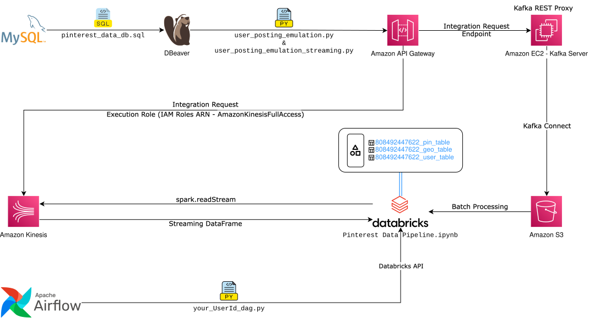

# Pinterest Data Pipeline

<p align="center">
    <a href="assets/esp32-cam.drawio.svg">
        
    </a>
</p>

---
[](https://www.python.org/downloads/release/python-31015/)

## Table of Contents
- [Overview](#overview)
- [Architecture](#architecture)
- [Components](#components)
  - [Core Scripts](#core-scripts)
  - [Infrastructure](#infrastructure)
- [Setup and Installation](#setup-and-installation)
  - [Prerequisites](#prerequisites)
  - [Configuration Files](#configuration-files-igonred-in-gitignore)
  - [Setup Steps](#setup-steps)
- [Installation](#installation)
- [Usage](#usage)
  - [Batch Processing](#batch-processing)
  - [Stream Processing](#stream-processing)
  - [Airflow DAGs](#airflow-dags)
- [Project Structure](#project-structure)
- [Security Notes](#security-notes)
- [License](#license)

## Overview
This project implements a sophisticated data pipeline that processes Pinterest-like data through various AWS services, combining both batch and stream processing capabilities. The pipeline demonstrates modern data engineering practices by integrating multiple AWS services and open-source tools to create a robust, scalable data processing solution.

## Architecture
The pipeline consists of several components working together:

1. **Data Ingestion**
   - Extracts data from a MySQL database (local/RDS)
   - Processes three main data types:
     - Pinterest post data
     - Geolocation data
     - User data

2. **Data Processing Paths**
   - **Batch Processing Path**:
     - Kafka REST Proxy on EC2 for data ingestion
     - S3 storage via Kafka Connect
     - Databricks for data transformation
   - **Streaming Path**:
     - Amazon Kinesis for real-time data streaming
     - Direct integration with Databricks

3. **Orchestration**
   - Apache Airflow (local/MWAA) for workflow management
   - Integration between Airflow and Databricks

Please note there are two architecture diagrams:
1. Cloud architecture diagram: [Pinterest_Data_Pipeline_cloud.drawio.svg](img/Pinterest_Data_Pipeline_cloud.drawio.svg)
2. Hybrid setup diagram: [Pinterest_Data_Pipeline_local_DB_Airflow.drawio.svg](img/Pinterest_Data_Pipeline_local_DB_Airflow.drawio.svg)

Here we deployed the hybrid mthod.

## Components

### Core Scripts
- `user_posting_emulation.py`: Handles batch processing via Kafka
- `user_posting_emulation_streaming.py`: Manages real-time data streaming via Kinesis
- `pinterest_data_pipeline.ipynb`: Jupyter notebook containing pipeline development and testing

### Infrastructure
- Amazon RDS/Local MySQL for data storage
- Amazon EC2 for Kafka broker hosting
- Amazon API Gateway for REST endpoints
- Amazon S3 for data lake storage
- Amazon Kinesis for stream processing
- Amazon MWAA (Managed Workflows for Apache Airflow)/local Apache Airflow
- Databricks for data transformation and analysis

## Setup and Installation

### Prerequisites
- AWS Account with appropriate permissions
- Python 3.10.13
- MySQL database
- Apache Kafka
- Databricks workspace
- Required Python packages (see [`airflow/requirements.txt`](`airflow/requirements.txt`))

### Configuration Files (igonred in .gitignore)
1. `api_creds.yaml`: API Gateway credentials
2. `aws_db_creds.yaml`: AWS RDS credentials
3. `local_db_creds.yaml`: Local database credentials

### Setup Steps
1. **Environment Setup**
   - Set Up a Virtual Environment (conda):

2. **Database Configuration**
   - Configure MySQL database using `pinterest_data_db.sql`
   - Set up credentials in appropriate YAML files

3. **AWS Services Setup**
   - Configure EC2 instance for Kafka
   - Set up API Gateway endpoints
   - Configure S3 buckets
   - Set up Kinesis streams
   - Configure MWAA environment


## Installation

Clone the Repository:
```
git clone https://github.com/luke-who/pinterest-data-pipeline542.git
```

## Usage

### Batch Processing
1. Start the Kafka services on EC2
2. Run the batch processing script:
   ```bash
   python user_posting_emulation.py
   ```

### Stream Processing
1. Ensure Kinesis streams are configured
2. Run the streaming script:
   ```bash
   python user_posting_emulation_streaming.py
   ```
### **For the rest of the pipeline and development see** `pinterest_data_pipeline.ipynb`

### Airflow DAGs
The `airflow/dags` directory contains the workflow definitions for orchestrating the pipeline tasks.

## Project Structure
```
├── .databricks/                                        # Databricks integration files
│   └── commit_outputs                                  # Output logs from Databricks commits
├── airflow/                                            # Apache Airflow configuration
│   ├── dags/                                           # Directory for Airflow DAG definitions
│   │   └── 808492447622.py                             # Main DAG file for workflow orchestration
│   └── requirements.txt                                # Python dependencies for Airflow
├── databricks_notebook_output/                         # Exported Databricks notebooks
│   ├── pinterest_data_pipeline.html                    # HTML version of the notebook
│   └── pinterest_data_pipeline.ipynb                   # Jupyter notebook version
├── img/                                                # Project documentation images
│   ├── Pinterest_Data_Pipeline_cloud.drawio.svg             # Cloud architecture diagram
│   └── Pinterest_Data_Pipeline_local_DB_Airflow.drawio.svg  # Hybrid setup diagram
├── user_posting_emulation.py                           # Batch processing implementation
├── user_posting_emulation_streaming.py                 # Streaming processing implementation
├── pinterest_data_pipeline.ipynb                       # Main development notebook
├── pinterest_data_db.sql                               # Database initialization script
├── LICENSE                                             # MIT License file
├── README.md                                           # Project documentation
└── .gitignore                                          # Git ignore rules
```

## Security Notes
- API keys and credentials should be stored securely
- Use appropriate IAM roles and permissions
- Never commit sensitive credentials to version control (use `.gitignore`)

## License
This project is licensed under the MIT License - see the [LICENSE](LICENSE) file for details.

